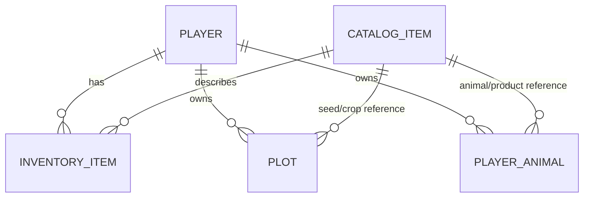

# Logical Database Schema (Future Firebase)

## 1) Core model (Cloud Firestore)

```text
players/{playerId}
  displayName: string
  money: number
  currentDay: number
  animalProducts:
    eggsCount: number
    milkCount: number
  createdAt: timestamp
  updatedAt: timestamp
  schemaVersion: number

  inventory/{itemId}
    itemId: string
    amount: number
    updatedAt: timestamp

  plots/{plotId}
    plotId: string
    plotIndex: number
    isOccupied: boolean
    plantedItemId: string | null
    updatedAt: timestamp
    crop:
      cropId: string
      harvestItemId: string
      totalGrowthMinutes: number
      currentStage: number
      plantedAt: timestamp

  animals/{animalType}
    animalType: string          // chicken | cow
    ownedCount: number
    maxCount: number
    productItemId: string       // egg | milk
    productionMinutes: number
    amountPerCycle: number
    updatedAt: timestamp

catalog/items/{itemId}
  itemId: string
  itemType: string              // seed | crop | product | animal
  buyPrice: number | null
  sellPrice: number | null
  cropId: string | null
  harvestItemId: string | null
  totalGrowthMinutes: number | null
  isActive: boolean
  updatedAt: timestamp
```

## 2) Entity relationships (logical ER)



## 3) Mapping from current code

- `GameSaveData.money` -> `players/{playerId}.money`
- `GameSaveData.currentDay` -> `players/{playerId}.currentDay`
- `GameSaveData.inventory[]` -> `players/{playerId}/inventory/{itemId}`
- `GameSaveData.plots[]` + `CropSaveData` -> `players/{playerId}/plots/{plotId}`
- `AnimalSaveData.chickensCount/cowsCount` -> `players/{playerId}/animals/chicken|cow`

## 4) Key rules

- Keep IDs (`playerId`, `itemId`, `plotId`) stable and immutable.
- Keep prices and item type metadata in `catalog` to avoid duplication.
- For crop growth, store both `plantedAt` and `currentStage` for reliable restore.
- Apply money changes atomically (Firestore batch/transaction).
